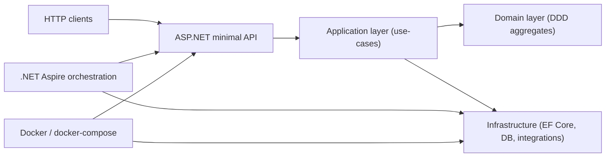

## OMG Backend Architecture

This document expands on the high-level architecture described in `README.md` and specifies how the OMG backend should be structured as a domain-driven modular monolith on .NET 10 with ASP.NET Core minimal APIs.

### Runtime and hosting

- Target framework: `net10.0` for all production and test projects.
- Hosting model: ASP.NET Core **minimal API**.
- HTTP surface: a RESTful API exposing garden, plant, and (bonus) irrigation/reporting operations.

### Layers and responsibilities

- **Domain**
  - Contains core business concepts and invariants:
    - Aggregates such as `Garden` and `Plant`.
    - Value objects such as `HumidityTarget` and surface area types.
    - Domain events (e.g., `PlantWatered`, `HumidityBelowTarget`).
  - No dependencies on `Application`, `Infrastructure`, or `Api`.
  - Pure C# types with no framework-specific dependencies where possible.

- **Application**
  - Implements use-cases aligned with user stories (US05–US22), such as:
    - Garden CRUD and overview.
    - Plant CRUD and surface area validation.
    - Irrigation simulation and reporting.
  - Coordinates domain objects and persistence abstractions (repositories, unit of work).
  - Depends on:
    - Domain layer.
    - Abstractions defined in the Infrastructure layer (e.g., repository interfaces), injected via DI.

- **Infrastructure**
  - Implements technical details:
    - EF Core DbContext and entity configurations.
    - Database provider configuration.
    - Outbound integrations (email, metrics, messaging) if needed.
  - Exposes abstractions (e.g., repositories) consumed by the Application layer.
  - No direct coupling to Api DTOs or HTTP concerns.

- **Api**
  - ASP.NET Core minimal API project.
  - Responsibilities:
    - Define endpoints (e.g., `/api/health`, `/api/gardens`, `/api/plants`).
    - Perform request validation and mapping between DTOs and domain/application types.
    - Configure middleware, OpenAPI/Swagger, problem details, and authorization.
  - Depends on:
    - Application layer.
    - DTOs and mapping helpers.

### Dependency rules

- Domain → (no internal dependencies).
- Application → Domain, Infrastructure abstractions.
- Infrastructure → Domain (for entity mapping), but not Api.
- Api → Application (and DTOs), but not Infrastructure.

### High-level data flow

### Testing strategy overview

- **Domain tests**
  - Unit tests for aggregates, value objects, and domain services.
  - Focus on invariants such as surface area limits and humidity rules.

- **Application tests**
  - Unit tests for use-case handlers/services.
  - Verify behavior with in-memory or mocked persistence abstractions.

- **API / integration tests**
  - Minimal API tests using an in-memory host and HTTP-level assertions.
  - Validate routing, serialization, and error handling, not internal implementation details.

### Docker and .NET Aspire rollout

- **Phase 1 – Docker & docker-compose**
  - Introduce a Dockerfile that builds and runs the ASP.NET minimal API targeting `net10.0` using a multi-stage build.
  - Add a `docker-compose.yml` that starts:
    - The API container.
    - The primary database used by the backend.
  - Use environment variables for configuration and avoid hard-coded credentials.

- **Phase 2 – .NET Aspire**
  - Add an Aspire AppHost project that orchestrates:
    - The API service.
    - The database.
    - Any additional workers or simulation/reporting components introduced for bonus stories.
  - Keep configuration consistent with the Docker/docker-compose setup so developers can switch between them easily.

As the implementation progresses, this document should be updated with concrete project names, namespaces, Dockerfile paths, compose service definitions, and Aspire project details, as well as any additional architectural patterns (e.g., CQRS, background workers, or specific integration patterns) introduced to support bonus features.

